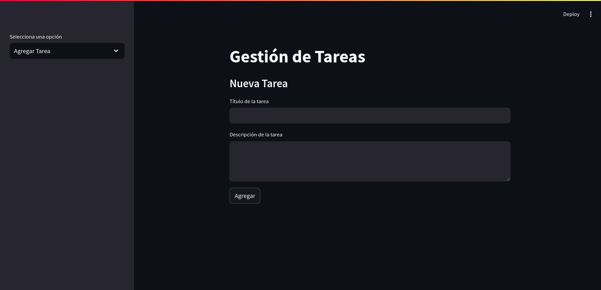

# 📝 Aplicación de Gestión de Tareas

Esta aplicación te permite agregar, listar, marcar como completadas, eliminar tareas y guardar o cargar tus tareas desde un archivo JSON. Ideal para mantener tus tareas organizadas y al día.

## 📦 Requisitos

Antes de ejecutar la aplicación, asegúrate de tener instalados los siguientes paquetes:

- Python 3.x
- Streamlit
- SQLAlchemy
- SQLite

## 🚀 Funcionalidades
### 1. Agregar Tareas 🆕
Agrega nuevas tareas a tu lista con un título y una descripción. ¡No te olvides de asignar tareas importantes! 😄

### 2. Listar Tareas 📋
Visualiza todas tus tareas, incluyendo su título, descripción y estado (completada o pendiente). Así podrás tener todo bajo control. ✔️

### 3. Marcar Tareas como Completadas ✅
Marca las tareas completadas para ver cómo avanza tu productividad. ¡Verás cómo se va vaciando tu lista de pendientes! 🚀

### 4. Eliminar Tareas 🗑️
Elimina cualquier tarea de la lista. Ya sea porque está completada o simplemente porque ya no la necesitas. ¡Nada de tareas viejas! 🧹

### 5. Guardar y Cargar Tareas 💾
Guarda tus tareas en un archivo JSON para no perderlas, o carga las tareas previamente guardadas desde un archivo. ¡Nunca perderás el control! 🔄

## 🎨 Interfaz Gráfica
La aplicación utiliza Streamlit para proporcionar una interfaz gráfica de usuario simple e interactiva. ¡Todo se hace con solo unos clics!

## 🏗️ Instalación
Clona o descarga el repositorio:

```bash
git clone https://github.com/riadfrancoq/taskManager
cd taskManager
```
Instala las dependencias:

```bash
pip install -r dependencies.txt
```
Ejecuta la aplicación:

```bash
streamlit run app.py
```

##  📷 Imagenes


